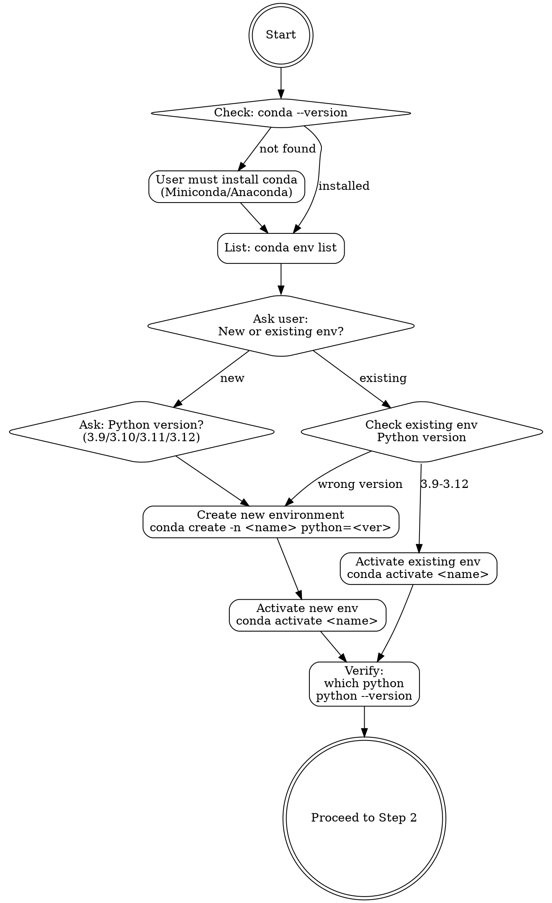

# MindSpore Linux CPU Compilation

## Overview

Systematic workflow for compiling MindSpore from source on Linux x86_64 with CPU support. Core principle: verify environment at each stage before proceeding to avoid cascading failures.

## When to Use

**Use this skill when:**
- User requests MindSpore compilation from source on Linux
- Building on Linux x86_64 (Ubuntu, CentOS, Debian, etc.)
- Troubleshooting build failures or dependency errors on Linux
- Setting up development environment for MindSpore on Linux
- Keywords: "compile", "build from source", "编译", "源码编译", "compilation error", "Linux"

**Don't use for:**
- Installing pre-built MindSpore packages (use pip/conda instead)
- macOS or Windows compilation (different toolchain)
- Runtime errors after successful installation
- GPU/NPU builds (use gpu-builder or npu-builder skills)

## Quick Reference

| Stage | Key Command | Verification |
|-------|-------------|--------------|
| 1. Environment (FIRST) | `conda activate <env_name>` | `which python` points to conda env, version 3.9-3.12 |
| 2. Source | `git clone https://gitcode.com/mindspore/mindspore.git` | `build.sh` exists |
| 3. System Deps | `sudo apt-get install gcc-7 git tcl patch libnuma-dev -y` | `gcc --version` shows 7.3.0+ |
| 4. CMake | `conda install cmake=3.22.3 patch autoconf scipy -y` | `which cmake` points to conda env |
| 5. LLVM | `sudo apt-get install llvm-12-dev -y` | `llvm-config --version` shows 12.x |
| 6. Python Deps | `pip install wheel setuptools pyyaml numpy pybind11` | Packages installed in conda env |
| 7. Build | `export MSLIBS_CACHE_PATH=$(pwd)/.mslib && bash build.sh -e cpu -j8 -S on` | Check `output/` |
| 8. Install | `pip install output/mindspore-*.whl` | `import mindspore` works |
| 9. Verify | `mindspore.run_check()` | Success message |

**Typical build time:** 30-60 minutes (first build)
**Disk space required:** 20GB minimum
**Troubleshooting:** See `reference/troubleshooting.md` for error patterns

## Prerequisites

- **OS**: Linux x86_64 (Ubuntu 18.04+)
- **Compiler**: GCC 7.3.0-9.4.0
- **Python**: 3.9-3.12
- **CMake**: 3.22.3 or higher
- **Disk Space**: At least 20GB

## Compilation Steps

### Step 1: Set Up and Activate Conda Environment (REQUIRED FIRST)

**CRITICAL**: All subsequent steps MUST run within an activated conda environment with Python 3.9-3.12.



**First, check if conda is installed:**
```bash
conda --version
```

**Check existing environments:**
```bash
conda env list
```

**Ask the user to choose:**
1. Create a new conda environment (ask which Python version: 3.9, 3.10, 3.11, or 3.12)
2. Use an existing conda environment (ask for environment name)

**For new environment:**
```bash
# Create environment with user-specified Python version
# Example: conda create -n mindspore_py310 python=3.10 -y
conda create -n <env_name> python=<version> -y
conda activate <env_name>

# Verify activation and Python version
python --version
which python
```

**For existing environment:**
```bash
# Activate existing environment
conda activate <existing_env_name>

# Verify Python version is supported (3.9-3.12)
python --version
which python
```

**STOP HERE if environment is not activated.** All following commands assume you are in the activated conda environment.

### Step 2: Prepare Source Code

Navigate to or clone the MindSpore source directory.

```bash
# Check if in MindSpore source directory (check for build.sh)
if [ -f "build.sh" ]; then
    echo "Already in MindSpore source directory"
elif [ -d "mindspore" ] && [ -f "mindspore/build.sh" ]; then
    echo "Found MindSpore in ./mindspore"
    cd mindspore
else
    echo "Cloning MindSpore source code..."
    git clone -b master https://gitcode.com/mindspore/mindspore.git ./mindspore
    cd mindspore
fi
```

### Step 3: Install System Dependencies

**PREREQUISITE**: Conda environment must be activated (Step 1).

**Install minimal required system packages:**
```bash
sudo apt-get install gcc-7 git tcl patch libnuma-dev -y
```

**Verify GCC installation:**
```bash
gcc --version  # Should show 7.3.0 or higher
```

**If GCC < 7.3.0, install newer version:**
```bash
sudo apt install -y gcc-9 g++-9
sudo update-alternatives --install /usr/bin/gcc gcc /usr/bin/gcc-9 90
sudo update-alternatives --install /usr/bin/g++ g++ /usr/bin/g++-9 90
```

### Step 4: Install CMake and Build Tools (Within Activated Environment)

**PREREQUISITE**: Conda environment must be activated (Step 1).

**Install CMake and build tools via conda:**
```bash
# These install into the active conda environment
conda install cmake=3.22.3 patch autoconf scipy -y

# Verify cmake is from conda environment
which cmake
cmake --version
```

### Step 5: Install LLVM

**LLVM is required for graph fusion optimization:**
```bash
wget -O - https://apt.llvm.org/llvm-snapshot.gpg.key | sudo apt-key add -
sudo add-apt-repository "deb http://apt.llvm.org/bionic/ llvm-toolchain-bionic-12 main"
sudo apt-get update
sudo apt-get install llvm-12-dev -y
```

**Verify LLVM installation:**
```bash
llvm-config --version  # Should show 12.x
```

### Step 6: Install Python Dependencies (Within Activated Environment)

**PREREQUISITE**: Conda environment must be activated (Step 1).

**Install required Python packages:**
```bash
# Install within activated conda environment
pip install wheel==0.46.3 PyYAML==6.0.2 numpy==1.26.4 pybind11 setuptools \
    -i https://repo.huaweicloud.com/repository/pypi/simple/
```

**Verify installation:**
```bash
# Verify packages are installed in conda environment
pip list | grep -E "wheel|PyYAML|numpy|pybind11|setuptools"
```

### Step 7: Compile MindSpore (Within Activated Environment)

**PREREQUISITE**: Conda environment must be activated with all dependencies installed.

**Set environment variable and execute compilation:**
```bash
# Set cache path for third-party libraries
export MSLIBS_CACHE_PATH=$(pwd)/.mslib

# Verify environment before building
echo "Python: $(which python)"
echo "CMake: $(which cmake)"

# Compile MindSpore
bash build.sh -e cpu -j8 -S on
```

**Parameters**:
- `MSLIBS_CACHE_PATH`: Cache path for third-party libraries
- `-e cpu`: CPU-only build
- `-j8`: Use 8 threads (adjust based on CPU cores, e.g., -j4 for 4 cores)
- `-S on`: Use mirror sources for faster download

### Step 8: Install MindSpore

**Install the built wheel package:**
```bash
pip uninstall mindspore -y
pip install output/mindspore-*.whl -i https://repo.huaweicloud.com/repository/pypi/simple/
```

**For upgrading existing installation:**
```bash
pip install --upgrade output/mindspore-*.whl
```

### Step 9: Verify Installation

**Basic check:**
```bash
python -c "import mindspore;print(mindspore.__version__)"
python -c "import mindspore;mindspore.set_device(device_target='CPU');mindspore.run_check()"
```

**Expected:**
```
MindSpore version: [version number]
The result of multiplication calculation is correct, MindSpore has been installed on platform [CPU] successfully!
```

**Optional CI test suite:** See `reference/ci-testing.md` for comprehensive testing instructions.

## Common Mistakes

**Most critical mistakes to avoid:**

| Mistake | Symptom | Fix |
|---------|---------|-----|
| Conda environment not activated | Dependencies install to system Python | Verify: `which python` points to conda env |
| Old GCC version | C++17 errors, unsupported flags | Install GCC 7.3.0+: `sudo apt install gcc-9 g++-9` |
| Stale CMake cache | Error persists after installing packages | Delete `build/mindspore/CMakeCache.txt` and rebuild |

**For complete mistake reference:** See `reference/common-mistakes.md`

**When build fails:**
1. Check `reference/troubleshooting.md` for matching error pattern
2. Verify all environment variables are set
3. Check disk space: `df -h .`
4. Verify compiler version (GCC 7.3.0+) and LLVM installation

## User Interaction Guidelines

- Explain each major step before execution
- Wait for user to install system dependencies if missing (sudo required)
- Display version info and verification results after completion
- **When compilation fails**: First consult `reference/troubleshooting.md` for matching error patterns before suggesting generic fixes
- Provide error log location and context-specific solutions based on troubleshooting history
