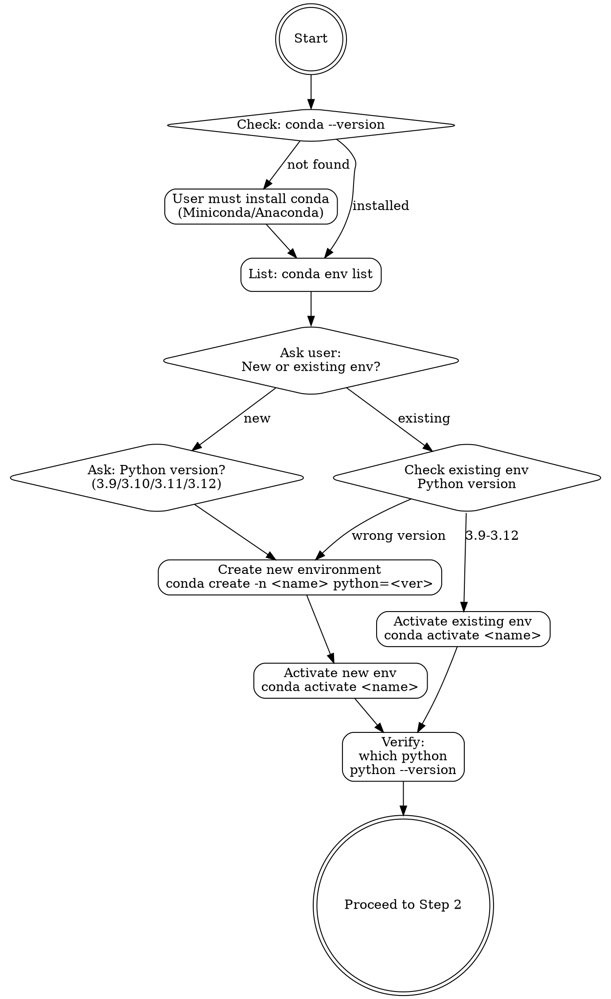

# MindSpore macOS Compilation

## Overview

Systematic workflow for compiling MindSpore from source on macOS Apple Silicon. Core principle: verify environment at each stage before proceeding to avoid cascading failures.

## When to Use

**Use this skill when:**
- User requests MindSpore compilation from source
- Building on macOS Apple Silicon (M1/M2/M3)
- Troubleshooting build failures or dependency errors
- Setting up development environment for MindSpore
- Keywords: "compile", "build from source", "编译", "源码编译", "compilation error"

**Don't use for:**
- Installing pre-built MindSpore packages (use pip/conda instead)
- Linux or Windows compilation (different toolchain)
- Runtime errors after successful installation

## Quick Reference

| Stage | Key Command | Verification |
|-------|-------------|--------------|
| 1. Environment (FIRST) | `conda activate <env_name>` | `which python` points to conda env, version 3.9-3.12 |
| 2. Dependencies | `conda install cmake=3.22.3 patch autoconf -y` + `pip install ... pybind11` | `which cmake` points to conda env |
| 3. Source | `git clone https://gitcode.com/mindspore/mindspore.git` | `build.sh` exists |
| 4. Build | `bash build.sh -e cpu -S on -j8` | Check `output/` directory |
| 5. Install | `pip install output/mindspore-*.whl` | `import mindspore` works |
| 6. Verify | `mindspore.run_check()` | Prints success message |

**Typical build time:** 30-60 minutes (first build)
**Disk space required:** 20GB minimum
**Troubleshooting:** See `reference/troubleshooting.md` for error patterns

## Prerequisites

- **OS**: macOS (Apple Silicon)
- **Compiler**: Apple Clang
- **Disk Space**: At least 20GB

## Compilation Steps

### Step 1: Set Up and Activate Conda Environment (REQUIRED FIRST)

**CRITICAL**: All subsequent steps MUST run within an activated conda environment with Python 3.9-3.12.



**First, check if conda is installed:**
```bash
conda --version
```

**Check existing environments:**
```bash
conda env list
```

**MUST ask the user to choose:**
1. Create a new conda environment (MUST ask which Python version: 3.9, 3.10, 3.11, or 3.12)
2. Use an existing conda environment (MUST ask for environment name)

**For new environment:**
```bash
# Create environment with user-specified Python version
# Example: conda create -n mindspore_py310 python=3.10 -y
conda create -n <env_name> python=<version> -y
conda activate <env_name>

# Verify activation and Python version
python --version
which python
```

**For existing environment:**
```bash
# Activate existing environment
conda activate <existing_env_name>

# Verify Python version is supported (3.9-3.12)
python --version
which python
```

**STOP HERE if environment is not activated.** All following commands assume you are in the activated conda environment.

### Step 2: Check Dependencies (Within Activated Environment)

**PREREQUISITE**: Conda environment must be activated (Step 1).

#### System Tools

**Xcode Command Line Tools** (Required)
```bash
xcode-select -p
# If not installed, prompt user to run:
# xcode-select --install
```

**Install build tools via conda** (within activated environment)
```bash
# These install into the active conda environment
conda install cmake=3.22.3 patch autoconf scipy -y

# Verify cmake is from conda environment
which cmake
cmake --version
```

#### Python Packages

```bash
# Install within activated conda environment
pip install wheel==0.46.3 PyYAML==6.0.2 numpy==1.26.4 pybind11 -i https://repo.huaweicloud.com/repository/pypi/simple/

# Verify packages are installed in conda environment
pip list | grep -E "wheel|PyYAML|numpy|pybind11"
```

### Step 3: Prepare Source Code

Navigate to or clone the MindSpore source directory.

```bash
# Check if in MindSpore source directory (check for build.sh)
if [ -f "build.sh" ]; then
    echo "Already in MindSpore source directory"
elif [ -d "mindspore" ] && [ -f "mindspore/build.sh" ]; then
    echo "Found MindSpore in ./mindspore"
    cd mindspore
else
    echo "Cloning MindSpore source code..."
    git clone -b master https://gitcode.com/mindspore/mindspore.git ./mindspore
    cd mindspore
fi
```

### Step 4: Compile MindSpore (Within Activated Environment)

**PREREQUISITE**: Conda environment must be activated with all dependencies installed.

Set environment variables:

```bash
# Use .mslib in current directory for cache
export MSLIBS_CACHE_PATH=$(pwd)/.mslib
export CC=/usr/bin/clang
export CXX=/usr/bin/clang++

# Verify environment
echo "Python: $(which python)"
echo "CMake: $(which cmake)"
echo "CC: $CC"
echo "CXX: $CXX"
```

Execute compilation:

```bash
# Ensure in MindSpore source directory and conda environment is active
bash build.sh -e cpu -S on -j8
```

**Parameters**:
- `MSLIBS_CACHE_PATH`: Cache path for third-party libraries
- `-e cpu`: CPU-only build
- `-S on`: Enable symbol table
- `-j8`: Use 8 threads (adjust based on CPU cores)

### Step 5: Install MindSpore

```bash
# Re-install wheel package
pip uninstall mindspore -y
pip install output/mindspore-*.whl -i https://repo.huaweicloud.com/repository/pypi/simple/
```

### Step 6: Verify Installation

**Basic check:**
```bash
python -c "import mindspore;print(mindspore.__version__)"
python -c "import mindspore;mindspore.set_device(device_target='CPU');mindspore.run_check()"
```

**Expected:**
```
MindSpore version: [version number]
The result of multiplication calculation is correct, MindSpore has been installed on platform [CPU] successfully!
```

**Optional CI test suite:** See `reference/ci-testing.md` for comprehensive testing instructions.

## Common Mistakes

**Most critical mistakes to avoid:**

| Mistake | Symptom | Fix |
|---------|---------|-----|
| Conda environment not activated | Dependencies install to system Python | Verify: `which python` points to conda env |
| Missing Xcode tools | `clang: command not found` | Run `xcode-select --install` |
| Stale CMake cache | Error persists after installing packages | Delete `build/mindspore/CMakeCache.txt` and rebuild |

**For complete mistake reference:** See `reference/common-mistakes.md`

**When build fails:**
1. Check `reference/troubleshooting.md` for matching error pattern
2. Verify all environment variables are set
3. Check disk space: `df -h .`

## User Interaction Guidelines

- Explain each major step before execution
- Display version info and verification results after completion
- **When compilation fails**: First consult `reference/troubleshooting.md` for matching error patterns before suggesting generic fixes
- Provide error log location and context-specific solutions based on troubleshooting history
